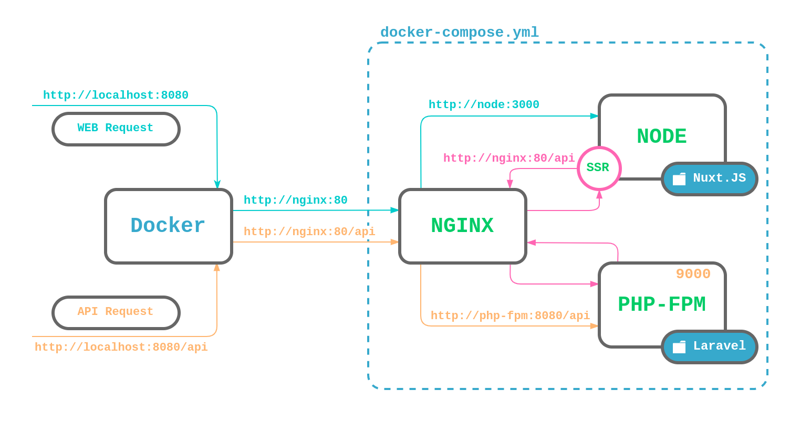

# i-want-to-break-free-laravel-nuxt
> template docker for laravel+nuxt

## Prerequisites
Well tested on `Ubuntu 19.10`, `macOS 10.14.6`

## About the structure
Laravel API and Nuxt are totally separate from each other and there are some reasons why I don't mix them up.
- First, throwing two frameworks together is a guaranteed mess in the future.
- API should be the only one layer of coupling. 
- You can host them on the different servers.
- You can even split them into separate repositories if (when) the project will grow.  
- You can even add a third project, for example, a mobile APP, which will use the same API also.

## Basic usage
Your base url is `http://localhost:8080`. All requests to Laravel API must be sent using to the url starting with `/api` prefix. Nginx server will proxy all requests with `/api` prefix to the node static server which serves the Nuxt. 

There is also available [http://localhost:8081](http://localhost:8081) url which is handled by Laravel and should be used for testing purposes only.

You **don't** need to configure the api to allow cross origin requests because all requests are proxied through the Nginx.

The following image demonstrates a request path going through the environment.


## Install
set up laravel permissions:
```bash
sudo chmod -R 777 laravel/bootstrap/cache
sudo chmod -R 777 laravel/storage
```

copy environment files:
```bash
cp .env.nuxt nuxt/.env
cp .env.laravel laravel/.env
```

init docker containers && start project:
```bash
git clone https://github.com/mioe/i-want-to-break-free-laravel-nuxt app
cd app
docker-compose up # first start (5-10 min)
# or
docker-compose up -d
```

init laravel:
```bash
docker-compose exec laravel bash # -> open bash terminal
composer install
php artisan key:generate
php artisan migrate
```

Enjoy 😙
